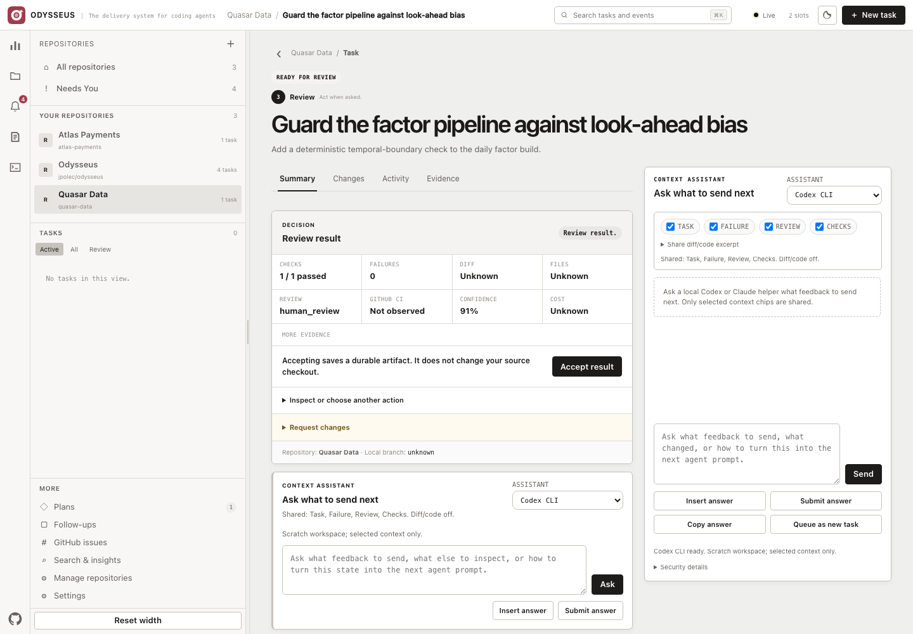
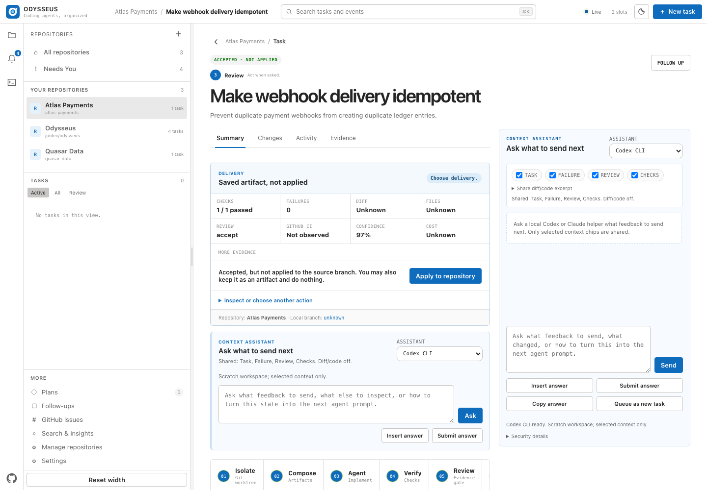
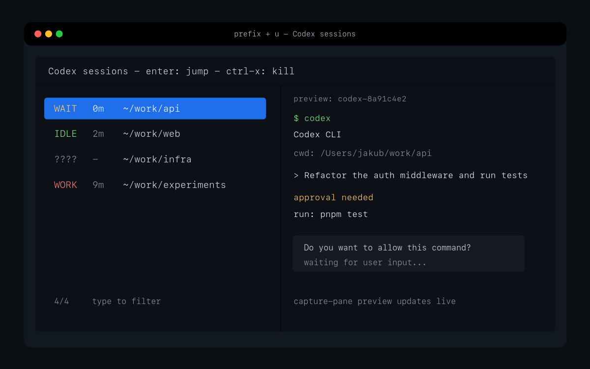
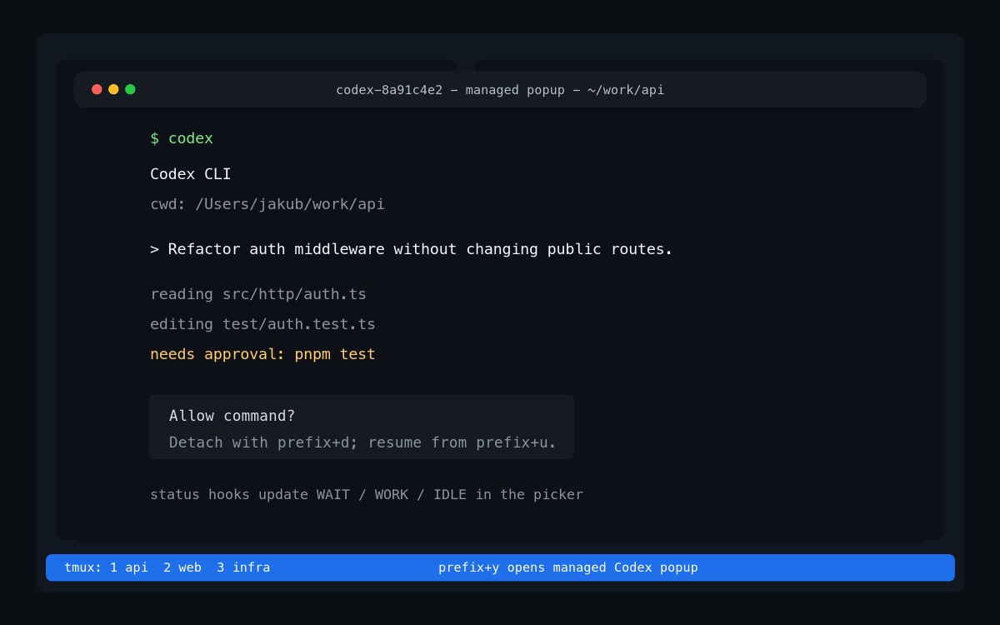

# Odysseus


**Zero runtime dependencies. No database. Auditable NDJSON. Your terminal stays
first-class.**

Odysseus adds durable queues, approval-gated task DAGs, isolated Git worktrees,
optional Docker boundaries, independent evidence, and a focused **Needs You**
queue to the coding agents and tmux sessions you already use. Its light web UI
is also a live window into existing tmux sessions:
discovery is automatic, while tracking and terminal handoff stay explicit.

The web workbench keeps one path visible at all times: **1 Choose a repository ->
2 New task -> 3 Follow & review**. Each numbered step is also a shortcut to the
right place. Choose an agent beside the task, then use **Start & add another**
to queue several independent tasks without leaving the composer. Checks,
budgets, evaluation, and integration evidence remain under **More options**.

The nouns are literal: **Odysseus is the application, a repository is one local
Git checkout, and a task is one requested change**. The Git remote supplies the
human-facing name; the local folder and absolute path identify the exact
checkout. **Your repositories** is the saved local list; **Remove** forgets an
entry without deleting its directory or files. Passive tmux discovery never
adds repositories by itself.

[Quick start](START.md) · [Complete usage guide](docs/USAGE.md) ·
[Use cases](USE_CASES.md) · [Roadmap](ROADMAP.md) ·
[Version and capabilities](VERSION.md) · [Security](SECURITY.md) ·
[Release proof](PROOF.md) · [Production proof](PRODUCTION_PROOF.md) ·
[Protocol and API](docs/odysseus-protocol.md)

## Why Odysseus

- **Keep tmux.** Existing Codex and Claude panes appear automatically and stay
  usable from the terminal.
- **Compose parallel work.** Accepted predecessor tasks become durable local
  Git artifacts that are merged into the downstream task's isolated branch.
- **Reach green.** Published draft PRs are watched; failed logs return to the
  original session, fixes are pushed, and retry budgets stop infinite loops.
- **Plan before spending.** A read-only Planner proposes an acyclic task graph;
  the operator approves it before ready tasks can run.
- **See only what needs you.** Questions, permissions, broken dependencies,
  failures, evaluation findings, and review gates share one attention queue.
- **Continue, do not restart.** Feedback returns to the saved agent thread and
  the same worktree. Continue in terminal opens that thread interactively in tmux.
- **Recover in place.** A failed task puts **Resume with feedback** immediately
  below the failure. The optional context assistant can ask local Codex or
  Claude what to send next, then insert or submit its answer without leaving
  the browser.
- **See the work.** The UI exposes normalized messages, reasoning summaries,
  tool calls/results, token and cache usage, checks, independent evaluation,
  confidence, policy, and live activity.
- **Keep control.** Accept saves a local artifact without touching the source
  checkout. A separate, confirmed **Apply to repository** action merges it only
  when the checkout is clean, on the expected branch, and history is compatible.
- **Choose the runtime boundary.** Keep host compatibility, use a repository
  devcontainer, or run agent/check/review commands in disposable Docker
  containers with scoped mounts, credentials, ports, network, CPU, and memory.
- **Operate more than one repository.** Repositories, tasks, tmux sessions, GitHub
  issues, and follow-ups share one local control plane.
- **Onboard from evidence.** A repository's Overview reads its existing README,
  detects agent instructions and stack markers, shows recent commits, and
  projects every significant task event into one human-readable timeline.
- **Reuse engineering judgment.** Each repository gets a previewable catalog of
  generic security, database, API, testing, accessibility, performance, and
  maintenance skills. Set a skill to Auto, Required, or Disabled; task-specific
  manual selection stays optional.
- **Know why context was used.** Every task stores a Context Receipt containing
  the exact README, instruction, brief, and skill snapshots sent to the agent,
  with selection reasons and content digests visible under Evidence.
- **Remember repository-specific facts safely.** Repository Memory attaches enabled
  guidance by trigger or folder. Repeated feedback becomes a suggestion, never
  automatic memory; an operator must review and save it.
- **Route skills from local evidence.** Auto selection explains task signals
  and, once enough outcomes exist, adjusts ranking with this repository's success
  and intervention history.
- **Stay inspectable.** State is JSON plus append-only NDJSON. The runtime uses
  Python's standard library and browser-native JavaScript—no database, Redis,
  Node build, or mandatory container.

## Quick start

Requirements: Python 3.10+, Git, and Codex CLI and/or Claude Code. Docker is
optional and only required for isolated execution. tmux and fzf are needed for
terminal controls; authenticated `gh` is needed for GitHub issue intake and
draft pull requests.

Run directly with `uvx`—nothing is added permanently to your environment:

```sh
uvx --from git+https://github.com/jpolec/odysseus odysseus start --open
```

Or install the command persistently with `pipx`:

```sh
pipx install git+https://github.com/jpolec/odysseus
odysseus doctor
odysseus start --open
```

The Python package has no runtime dependencies. `uvx`/`pipx` install the CLI,
web assets, bundled generic Skills, and demo. The tmux key bindings remain an
optional TPM plugin because they must be loaded by tmux itself.

The shell installer is the third option:

```sh
curl -fsSL https://raw.githubusercontent.com/jpolec/odysseus/main/install.sh | bash
odysseus start --open
```

Review [`install.sh`](install.sh) before piping it if that is your preference.
It resolves the latest stable GitHub release, installs that exact tag under
`~/.local/share`, atomically switches a `current` link, preserves the previous
release, backs up mutable state, links only the command into `~/.local/bin`,
and runs `doctor`. It never silently installs `main`. An equally simple
checkout-based development install is:

```sh
git clone https://github.com/jpolec/odysseus.git
cd odysseus && ./install.sh
```

Manage a versioned shell installation without replacing the running release in
place:

```sh
odysseus version
odysseus update --check
odysseus update
odysseus rollback

# explicitly opt into main
odysseus update --edge
```

Updates are validated against a copy of your state before the atomic switch.
Install, update, and rollback refuse to run while the server or a live agent
worker owns the state directory. Backups carry a SHA-256 digest and state
identity; restore extracts and validates off to the side before replacing any
live record. Rollback preserves worktrees and runtime directories. A normal
update never crosses a state-schema downgrade; the matching recovery path is
the explicit `odysseus rollback --restore-state`. You can audit state directly
with `odysseus state verify`. Package installs stay owned by their
package manager: use `pipx upgrade odysseus-agents`; `uvx` resolves its tool
environment for each invocation.

Without `--open`, visit <http://127.0.0.1:8741/>. The first screen shows the
same three numbered steps used everywhere else: choose one repository, describe
one finished outcome, then follow and review the result. Select **Start task**
after step 2. Agent choice, checks, limits,
Skills, execution environments, planning, Context Receipts, and repository history remain available as
progressive depth instead of blocking the first run. See [START.md](START.md)
for the complete five-minute path.

Submitting clears the request immediately and shows **Starting**. **Start task**
opens the live run; **Start & add another** leaves a fresh composer so several
tasks can be queued quickly. `queued` means **Waiting to start** because all
configured agent slots are busy. Open **Settings**—or click the slot count in
the title bar—to change parallel capacity, default agents, retries, budgets,
CI behavior, and direct-API assistant models. API keys are never saved in the
browser or Odysseus state.

Starting the same state twice does not create a second scheduler. If Odysseus
is already listening on the selected port, `start --open` reports and opens
that instance. If the selected port is occupied by another service, the CLI
automatically tries the next port and opens the address it
actually selected (`8742`, `8743`, and so on).

To explore a populated control plane without spending model tokens:

```sh
odysseus demo
```

Open <http://127.0.0.1:8742/>. The disposable state demonstrates multiple
repositories, a planned task DAG, Needs You, merge risk, artifact composition, a failed CI
repair loop, tool telemetry, checks, evaluation, search, and outcome metrics.

Reproduce the web screenshots from that exact state with local Chrome/Chromium:

```sh
scripts/capture-web-screenshots.sh
```

The script writes eleven real browser captures—First run, Repositories, Repository,
Attention, Review, Delivery, Integration, CI repair, Context Receipt, New task,
and Settings—to `docs/screenshots/` and
removes its temporary state when finished. Each URL selects the intended
repository, task surface, or dialog, so filenames match the visible UI.

### Review, then deliver



The result cannot silently become source code. After acceptance, the next
screen still says **not applied** and offers explicit local or pull-request
delivery:



## Odysseus develops Odysseus

The repository contains its own deterministic checks in `.odysseus.json` and a
small dogfooding entry point:

```sh
scripts/dogfood.sh start
scripts/dogfood.sh run "Make start explain and recover from a port conflict"
scripts/dogfood.sh status
scripts/dogfood.sh proof
```

Every newly queued autonomous run records a versioned provenance envelope. The
`proof` command counts only terminal attempts with ordered start, agent activity,
and outcome evidence; early failures stay in the denominator. Delivery claims
also require the final verifier to pass before artifact creation and acceptance,
so merely queueing tasks or editing a status cannot inflate the result.
Seeded demo, test, imported tmux, and pre-0.6.3 unclassified history are
excluded. Missing model cost remains unobserved, draft PRs are not acceptance,
and operator response latency is not mislabeled as active human time. JSON uses
opaque receipt IDs; Markdown is the public aggregate. See
[PRODUCTION_PROOF.md](PRODUCTION_PROOF.md).

## Where tasks come from

| Source | What happens |
| --- | --- |
| **New task** in the web UI | A branch and worktree are created, then the bounded agent/check/review workflow runs. |
| `bin/odysseus run ...` | The same workflow is queued from a terminal or script. |
| **Plan feature** / `bin/odysseus plan ...` | A read-only planner proposes a DAG; tasks exist only after explicit approval. |
| Existing Codex/Claude tmux pane | It appears in **Agent terminals** automatically; no import button is required. |
| **Track in Odysseus** on a tmux pane | A durable shortcut is created without restarting, controlling, or interrupting the pane. |
| Inbox **Queue as agent task** | A human or agent follow-up becomes a queued task in its repository. |
| GitHub **Queue issue** | An open issue becomes a queued task through authenticated `gh`. |

Automatic discovery does not silently turn arbitrary panes into autonomous
jobs. Existing panes are visible without pressing anything. Use **Track in
Odysseus** only when an interactive pane should also appear in Tasks and have a
durable Odysseus shortcut.

### What to enter in the web forms

- **New task** is for one focused outcome. Write the request in natural
  language and choose the repository. Odysseus uses the default agent and repository
  checks and automatically relevant engineering skills; manual skill selection,
  execution environment, agent selection, custom checks, priority, retries, and budgets stay
  under **More options…**.
- **Plan feature** is for a feature that should become several
  dependent or parallel tasks. Describe the finished feature, not the task
  breakdown. The Planner proposes the graph and nothing runs before approval.
- **Agent terminals** requires no input. It discovers existing Codex/Claude tmux panes.
  Tracking one does not provide historical tool/token data that Odysseus never
  observed.
- **Inbox** parks follow-up work. Adding an item does not launch an agent;
  **Queue as agent task** does.

## The autonomous workflow

```text
queue -> isolated worktree -> host/container environment -> implementation agent -> project checks
      -> independent evaluation -> Needs You / policy
      -> approve / feedback / terminal / draft PR
```

For a larger requirement:

```text
requirement -> read-only Planner -> proposed DAG -> operator approval
            -> ready tasks fan out -> accepted artifacts -> isolated fan-in
            -> integration checks -> review -> draft PR -> CI repair -> green
```

```sh
bin/odysseus plan \
  --project /absolute/path/to/repository \
  --planner-lane claude \
  --lane codex \
  --review-lane claude \
  "Implement passkey authentication end to end"

bin/odysseus approve-epic EPIC_ID
```

Queue a task from the CLI:

```sh
bin/odysseus run \
  --project /absolute/path/to/repository \
  --lane codex \
  --review-lane claude \
  --check "python3 -m unittest discover -s tests -v" \
  --check "git diff --check" \
  "Implement the feature and cover it with tests"
```

Use Docker when the task should not inherit the server user's filesystem and
credentials. The image must already contain the selected agent CLI and the
tools required by the project:

```sh
bin/odysseus run \
  --project /absolute/path/to/repository \
  --environment docker \
  --image ghcr.io/your-org/coding-agent:latest \
  --network none \
  --cpus 2 --memory 4g \
  --allow-env OPENAI_API_KEY \
  --untrusted-project \
  "Audit and fix the parser without changing its public API"
```

`--allow-env` records only the variable name; its value is resolved at runtime
and never written to a run snapshot or event. Host, Docker, and devcontainer
processes receive a scoped environment; server API keys such as the Context
Assistant keys are not inherited unless the task explicitly allowlists them.
For an untrusted repository,
Odysseus accepts only the Docker profile and pauses in **Needs You** before any
repository-supplied setup, check, evaluator, or environment configuration runs.

At the review gate:

| Action | Result |
| --- | --- |
| **View changes** | Opens the complete diff before any delivery decision. |
| **Accept result** | Records approval and a durable local artifact commit; the source checkout remains unchanged. |
| **Apply to repository** | After acceptance, safely merges the complete artifact into the expected local branch, preserving unrelated untracked files and aborting tracked-edit or merge conflicts. |
| **Request changes instead** | Sends guidance to the saved implementation thread in the same worktree. |
| **Continue in terminal** | Resumes the exact implementation thread in a managed tmux session and copies its open command. |
| **Create draft PR** | Commits the task worktree, pushes its branch, and opens a draft pull request without changing the source checkout. |

`Ready for review`, `Accepted`, and `Applied` are deliberately different. The
review checklist shows **1 Review**, **2 Test**, and **3 Deliver**; until Apply
or a PR is chosen, the UI says that the source checkout is unchanged. For
`Failed` or `Needs You`, the recovery path stays directly below the status
message. The Summary **Context assistant** can draft feedback with the already
authenticated local Codex CLI or Claude Code CLI; no separate API key is
required for local mode. The full conversation and context toggles remain in
the side panel. Task, failure, review, and check context are explicit toggles,
while diff/code sharing is off by default. Local CLI helpers start in a blank
scratch workspace, not the task repository; they receive only selected context
by prompt, but still run with the filesystem permissions of the Odysseus user.
Direct ChatGPT or Claude API modes are optional and require `OPENAI_API_KEY` or
`ANTHROPIC_API_KEY` in the Odysseus server environment. Their non-secret model
names can be selected in **Settings**; the keys themselves are only reported as
configured or missing and are never persisted.

You do not need tmux for the normal workflow. Use **Continue in terminal** only
when you want an interactive shell, manual debugging, or direct control of the
saved agent thread. Odysseus preserves the same branch and worktree either way.

**Continue in terminal** does not steal or recreate work. It prepares the exact
saved agent thread in tmux, inside the existing task worktree, then copies the
command you paste into a terminal. **Request changes** continues that same thread
autonomously.

## tmux controls

Install with TPM by adding this before `run '~/.tmux/plugins/tpm/tpm'`:

```tmux
set -g @plugin 'jpolec/odysseus'
```

Reload tmux, press `prefix` + `I`, then use:

| Key | Action |
| --- | --- |
| `prefix` + `y` | Launch or reattach the current project's interactive agent. |
| `prefix` + `u` | Open the global agent-session picker. |
| `prefix` + `O` | Start or open the local Odysseus web control plane. |

Optional settings must precede the plugin line:

```tmux
set -g @odysseus_web_key 'O'
set -g @odysseus_web_port '8741'
set -g @ai_session_default_lane 'codex'
set -g @ai_session_lanes 'codex claude'
```

| Session picker | Managed agent session |
| --- | --- |
|  |  |

Optional Codex TUI status hooks:

```sh
~/.tmux/plugins/odysseus/scripts/install-hooks.sh
```

The web UI never injects keystrokes into an arbitrary pane. Tracking, resume,
and terminal handoff are explicit, auditable transitions. **Copy tmux command**
means exactly that: Odysseus copies a safe command which you paste into your own
terminal to open the same pane.

## Repositories, inbox, and GitHub

Repositories register when a managed task is queued or when you add one
explicitly. Passive tmux discovery never changes this list. Add one directly:

```sh
bin/odysseus projects --add /srv/repos/api --tag backend --tag production
```

The cross-project **Inbox** holds work that should not expand the current task.
Add an operator note in the UI or CLI:

```sh
bin/odysseus inbox \
  --project /srv/repos/api \
  --title "Migration follow-up" \
  --add "Add a rollback integration test"
```

An implementation agent can create `.odysseus-followups.json` in its worktree:

```json
[
  {
    "title": "Harden the migration rollback",
    "task": "Add a rollback integration test for the newly discovered edge case.",
    "priority": "high"
  }
]
```

Odysseus imports at most 50 entries and removes the handoff file before the
diff/review stage, so discovered work does not pollute the current patch.

## Configuration and state

The web **Settings** view is the normal place to change queue capacity, default
lanes, retries, budgets, CI repair behavior, and direct-API assistant models.
The title-bar slot count links there. API keys are deliberately excluded: local
Codex/Claude uses existing CLI login, while direct API keys must be supplied in
the server environment.

Checks can be supplied per task or committed as `.odysseus.json`:

```json
{
  "checks": [
    "python3 -m unittest discover -s tests -v",
    "git diff --check"
  ],
  "evaluators": [
    {
      "id": "security",
      "kind": "static",
      "command": "semgrep --config auto",
      "weight": 0.3
    }
  ],
  "environment": {
    "profile": "docker",
    "image": "ghcr.io/your-org/coding-agent:latest",
    "network": "bridge",
    "cpus": 2,
    "memory": "4g",
    "ports": {"APP_PORT": 3000},
    "setup": ["npm ci"]
  },
  "policy": {
    "min_confidence": 0.9,
    "require_human_review": true,
    "required_evaluators": ["security"]
  }
}
```

Task checks take precedence. Check and setup commands run through `/bin/sh -c`
inside the resolved execution profile and inherit a scoped server environment
including `PATH`; shell login files are deliberately not loaded. In ordinary mode, repository
configuration is trusted. `--untrusted-project` requires operator-controlled
Docker isolation and one explicit approval before repository commands run.

Global budgets, the CI repair loop, and notifications live in
`~/.odysseus/config.json`:

```json
{
  "budgets": {
    "timeout_seconds": 1800,
    "stall_seconds": 300,
    "max_tokens": 80000,
    "max_tool_calls": 120,
    "max_cost_usd": 8.0
  },
  "ci": {
    "watch": true,
    "auto_resume": true,
    "max_attempts": 2,
    "poll_seconds": 30
  },
  "notifications": [
    {"type": "ntfy", "name": "phone", "url": "https://ntfy.sh/your-private-topic"},
    {"type": "slack", "name": "engineering", "url": "https://hooks.slack.com/services/..."}
  ]
}
```

Per-task web/CLI budgets override global defaults. Notification destination
URLs can contain credentials; keep `config.json` private and never commit it.

State is stored under `~/.odysseus` by default:

```text
~/.odysseus/
├── config.json
├── projects.json
├── inbox.json
├── attention.json
├── notifications.ndjson
├── epics/<epic-id>.json
├── runs/<run-id>.json
├── events/<run-id>.ndjson
├── runtime/<run-id>/{environment.env,home,git}/
└── worktrees/<repository>-<sha>/<run-id>/
```

Override it with `ODYSSEUS_HOME` or `--state-dir`. Custom lanes can be added to
`config.json` as an argv array or shell-style command using `{worktree}` and
`{prompt}` placeholders. See [docs/USAGE.md](docs/USAGE.md) for examples and an
operator command reference.

## Remote and VPS

The server binds to loopback by default. It is designed for one operator on a
workstation or private VPS, not as a public multi-tenant application server.
HTTP work is threaded and bounded; live SSE streams have a separate limit and
shut down with the server. JSON/NDJSON writes use an inter-process file lock and
atomic snapshot replacement. For a private VPS installation:

```sh
sudo scripts/install-vps.sh --service-user "$USER"
ssh -N -L 8741:127.0.0.1:8741 USER@VPS
```

Open <http://127.0.0.1:8741/> on your workstation. The service stays private on
the VPS.

For mobile access without exposing Odysseus to the public internet, put the VPS
and your phone on the same Tailscale tailnet, then let the installer publish a
private tailnet URL while Odysseus itself remains on VPS loopback:

```sh
sudo scripts/install-vps.sh --service-user "$USER" --tailscale
```

Install the Tailscale app on the phone, sign in to the same tailnet, and open
the URL printed by the installer. Use `--tailscale-name vps-name.tailnet.ts.net`
when you already know the VPS tailnet DNS name and want the installer output to
be copy-pasteable.

To expose a public hostname with nginx Basic auth and Let's Encrypt TLS:

```sh
sudo scripts/install-vps.sh \
  --service-user odysseus \
  --domain agents.example.com
```

A direct remote bind without a password is refused unless the explicitly
unsafe override is supplied. Read [SECURITY.md](SECURITY.md) before exposing the
service. A reverse proxy or SSH tunnel remains required for TLS and
internet-facing connection handling; Odysseus does not claim high-availability
or horizontal multi-user operation.

## CLI operator commands

```sh
bin/odysseus runs
bin/odysseus epics
bin/odysseus plan --project /repo "Implement the requirement"
bin/odysseus approve-epic EPIC_ID
bin/odysseus attention
bin/odysseus answer ATTENTION_ID "Use option A"
bin/odysseus show RUN_ID
bin/odysseus events RUN_ID
bin/odysseus resume RUN_ID "Address the review findings"
bin/odysseus takeover RUN_ID
bin/odysseus sessions
bin/odysseus adopt TMUX_SESSION
bin/odysseus inbox
bin/odysseus projects
bin/odysseus accept RUN_ID
bin/odysseus draft-pr RUN_ID
bin/odysseus ci RUN_ID
bin/odysseus search "failing browser test"
bin/odysseus stats
bin/odysseus version
bin/odysseus update --check
bin/odysseus rollback
bin/odysseus export --output odysseus-state.json
bin/odysseus config --max-parallel 3
```

Use `bin/odysseus COMMAND --help` for command-specific arguments.

## Development

```sh
python3 -m unittest discover -s tests -v
# Optional real Docker proof when node:20-bookworm is available locally:
ODYSSEUS_DOCKER_TEST=1 python3 -m unittest tests.test_environments -v
python3 -m compileall -q odysseus
node --check web/app.js
bash -n scripts/*.sh codex_session_manager.tmux
git diff --check
```

See [ROADMAP.md](ROADMAP.md) for planned work and [VERSION.md](VERSION.md) for
the shipped capability matrix and upgrade notes.

## License

MIT. The original tmux manager was adapted from
[craftzdog/tmux-claude-session-manager](https://github.com/craftzdog/tmux-claude-session-manager),
also MIT licensed.
